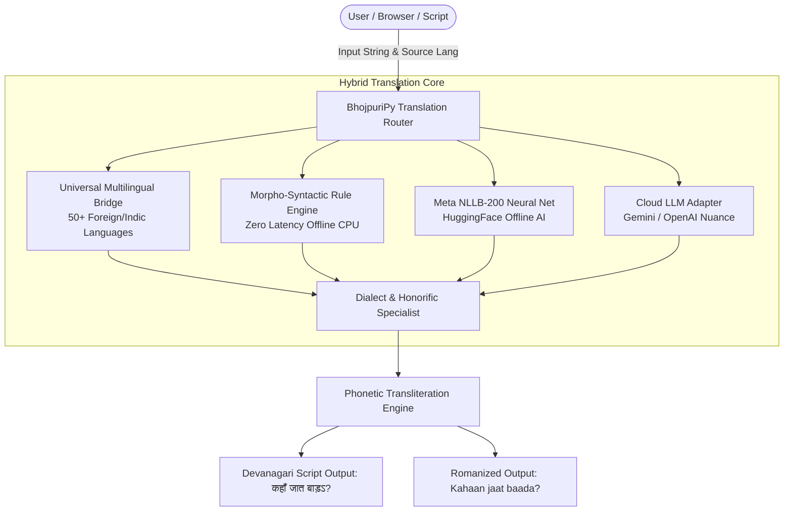

# 🌾 BhojpuriPy (भोजपुरीपाई)

<div align="center">

<h1>🌾 BhojpuriPy: The Universal Bhojpuri AI & NLP Engine</h1>
<p><b>An ultra-fast, multi-dialect translation framework & SDK for Bhojpuri (भोजपुरी) — spoken by 50M+ people worldwide.</b></p>

[](https://github.com/Chandanchaurasiya55/Python-Bhojpuri-Lang-Library/stargazers)
[](https://github.com/Chandanchaurasiya55/Python-Bhojpuri-Lang-Library/network/members)
[](https://python.org)
[](https://opensource.org/licenses/MIT)
[-orange?style=for-the-badge)](https://en.wikipedia.org/wiki/Bhojpuri_language)
[-brightgreen?style=for-the-badge)](https://github.com/Chandanchaurasiya55/Python-Bhojpuri-Lang-Library)

<br/>

> *"काहे होत बाड़ऽ हैरान, जब भोजपुरी में बा समाधान!"*  
> Translate any language (English, Hindi, Spanish, French, etc.) into authentic, culturally rich Bhojpuri with regional dialect tuning, Roman transliteration, and zero-GPU requirement.

[Quickstart](#-quickstart-in-30-seconds) • [Why BhojpuriPy?](#-why-bhojpuripy) • [Dialects](#-regional-dialect-matrix) • [Architecture](#-architecture) • [Star Milestones](#-star-milestones--roadmap) • [Contributing](#-contributing)

</div>

---

## ⚡ Why BhojpuriPy?

Standard translation tools (Google Translate, Meta NLLB) treat Bhojpuri as a single monolithic dialect and often mix formal Hindi grammar with Bhojpuri vocabulary. **BhojpuriPy** is built from the ground up by native linguists with fine-grained regional nuances:

| Feature | Generic Translators | Meta NLLB-200 | 🌾 BhojpuriPy |
| :--- | :---: | :---: | :---: |
| **Regional Dialects** (Purvanchal vs Bhojpur vs Saran) | ❌ No | ❌ No | ✅ **Yes (3 Native Dialects)** |
| **Honorific Tuning** (Informal `तू` vs Respectful `रउआ`) | ❌ No | ❌ No | ✅ **Yes (3 Formality Tiers)** |
| **Zero-Latency Offline Mode** (No GPU required) | ❌ Requires Cloud | ⚠️ Heavy (>2.5 GB) | ✅ **< 1ms Instant CPU Mode** |
| **Romanized Phonetics** (Devanagari ➔ Latin script) | ❌ Inaccurate | ❌ No | ✅ **Native Phonetic Converter** |
| **Bhojpuri Folk Idioms & Sayings** (कहावतें) | ❌ Literal word errors | ❌ Missing | ✅ **Curated Folk Lexicon** |
| **Web UI & Audio TTS Support** | ⚠️ Generic | ❌ CLI/Code only | ✅ **Interactive Indic Web App** |

---

## 🚀 Quickstart in 30 Seconds

```python
import bhojpuripy as bho

# 1. Translate from English to Bhojpuri
res = bho.translate("Hello, how are you?")
print(res["bhojpuri"])  # Output: प्रणाम, का हाल बा?
print(res["roman"])     # Output: Pranaam, kaa haal baa?

# 2. Regional Dialects (Purvanchal vs Bhojpur vs Saran)
# Standard (Bhojpur / Arrah / Buxar)
print(bho.translate("How are you?", dialect="standard")["bhojpuri"])
# -> का हाल बा?

# Western (Gorakhpur / Azamgarh / Banaras)
print(bho.translate("How are you?", dialect="western")["bhojpuri"])
# -> का हाल-चाल हवे?

# Northern (Saran / Siwan / Gopalganj)
print(bho.translate("How are you?", dialect="northern")["bhojpuri"])
# -> का हाल बाटे?

# 3. Formality / Honorific Control
# Elder / Respectful (Formal)
print(bho.translate("Where are you going?", honorific="formal")["bhojpuri"])
# -> रउआ कहाँ जात बानी?

# Peer / Friend (Familiar)
print(bho.translate("Where are you going?", honorific="familiar")["bhojpuri"])
# -> तू कहाँ जात बाड़ऽ?
```

---

## 🗺️ Regional Dialect Matrix

Bhojpuri varies vibrantly across geographical borders. **BhojpuriPy** natively supports three distinct dialect zones:

```
                  ┌────────────────────────────────────────────────────────┐
                  │                 Bhojpuri Linguistic Zones              │
                  └───────────────────────────┬────────────────────────────┘
                                              │
         ┌────────────────────────────────────┼────────────────────────────────────┐
         ▼                                    ▼                                    ▼
┌───────────────────────────────┐ ┌───────────────────────────────┐ ┌───────────────────────────────┐
│       Standard Bhojpuri       │ │       Western Bhojpuri        │ │       Northern Bhojpuri       │
│    (Bhojpur / Arrah / Buxar)  │ │ (Gorakhpur / Banaras / Deoria)│ │   (Saran / Siwan / Gopalganj) │
│                               │ │                               │ │                               │
│  Auxiliary: "बा", "बानी"      │ │  Auxiliary: "हवे", "हईं"      │ │  Auxiliary: "बाटे", "बानी"    │
│  Postposition: "खातिर"        │ │  Postposition: "बदे"          │ │  Postposition: "ला"           │
│  Example: "ई नीमन बा"         │ │  Example: "ई नीमन हवे"        │ │  Example: "ई नीमन बाटे"       │
└───────────────────────────────┘ └───────────────────────────────┘ └───────────────────────────────┘
```

### Direct Dialect Comparison

| Phrase | Standard (भोजपुर/बक्सर/आरा) | Western (गोरखपुर/बनारस/पूर्वांचल) | Northern (सारण/सीवान/गोपालगंज) |
| :--- | :--- | :--- | :--- |
| **How are you?** | **का हाल बा?** | **का हाल-चाल हवे?** | **का हाल बाटे?** |
| **Where are you going?** | **तू कहाँ जात बाड़ऽ?** | **तू कहाँ जात हवा?** | **तू कहाँ जात तारे?** |
| **What is your name?** | **तोहार नाम का बा?** | **तोहार नाम का हवे?** | **तोहार नाम का बाटे?** |
| **What are you doing?** | **तू का करत बाड़ऽ?** | **तू का करत हवा?** | **तू का करत तारे?** |
| **For me** | **हमार खातिर** | **हमार बदे** | **हमार ला** |
| **Where are you going? (Formal)** | **रउआ कहाँ जात बानी?** | **रउआ कहाँ जात हईं?** | **रउआ कहाँ जात बानी?** |

---

## 🏛️ System Architecture



---

## 💻 Command Line Interface (CLI)

BhojpuriPy provides an interactive terminal utility:

```bash
# Instant translation
bhojpuri "What is your name?"
# -> भोजपुरी : तोहार नाम का बा?
# -> Roman   : Tohaar naam kaa baa?

# Target a specific region
bhojpuri "This is very good." --dialect western
# -> भोजपुरी : ई बहुते नीमन हवे।

# JSON output for API pipelines
bhojpuri "See you tomorrow." --json
```

---

## 📜 Authentic Bhojpuri Idioms (कहावतें)

Bhojpuri culture has a rich heritage of proverbs that cannot be translated literally. BhojpuriPy includes an authentic idiom dictionary:

```python
import bhojpuripy as bho

idioms = bho.get_idioms()
for item in idioms[:3]:
    print(f"📜 {item['bhojpuri']}")
    print(f"   💡 Meaning: {item['english']}\n")
```

- **नाचे ना आवे त अँगने टेढ़** ➔ *A bad workman blames his tools*
- **जेकर लाठी ओकर भँइस** ➔ *Might is right*
- **अपने हाथे जगन्नाथ** ➔ *Self-help is the best help*
- **का बरखा जब खेत सुखाइल** ➔ *What use is rain after the crops are dead*

---

## ⭐ Star Milestones & Roadmap

Help us bring Bhojpuri language technology to the global stage! Star the repository to unlock upcoming features:

- [x] **v1.0.0**: Hybrid Multilingual Engine & Regional Dialects
- [ ] ⭐ **100 Stars**: HuggingFace Spaces Interactive Public Web Demo
- [ ] ⭐ **500 Stars**: Historical **Kaithi Script (कैथी लिपि)** Transliteration Engine
- [ ] ⭐ **1,000 Stars**: Bhojpuri **Whisper Speech-to-Text (STT)** fine-tuned model
- [ ] ⭐ **5,000 Stars**: Bhojpuri Indic-Llama fine-tuned open-source LLM weights release

---

## 📈 Star History

[](https://star-history.com/#Chandanchaurasiya55/Python-Bhojpuri-Lang-Library&Date)

---

## 🤝 Contributing

We warmly invite researchers, native speakers, and developers to contribute:
- Add vocabulary in [bhojpuripy/data/vocabulary.json](bhojpuripy/data/vocabulary.json)
- Add regional patterns in [bhojpuripy/data/grammar_patterns.json](bhojpuripy/data/grammar_patterns.json)
- Check our [CONTRIBUTING.md](CONTRIBUTING.md) and [CODE_OF_CONDUCT.md](CODE_OF_CONDUCT.md).

---

## 📑 Citation

If you use BhojpuriPy in your academic research, project, or publication:

```bibtex
@software{bhojpuripy2026,
  author = {Chandan Chaurasiya},
  title = {BhojpuriPy: High-Performance Multilingual Bhojpuri Machine Translation & NLP Engine},
  year = {2026},
  url = {https://github.com/Chandanchaurasiya55/Python-Bhojpuri-Lang-Library}
}
```

---

<div align="center">

**Made with ❤️ for Bhojpuri & the Global Indic NLP Community**  
<sub>Licensed under the MIT License</sub>

</div>
